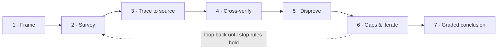

# BLCaptain-Research-Driven Investigation

> Move an AI agent from "hand over the first plausible answer" to "construct a conclusion that survives attack" — more correct, more economical, more honest.

[中文 README](README.md)


[](LICENSE)



> **The seven-step investigation loop — investigate, don't retrieve, and know when to stop.** The two moves to watch: **disconfirmation** (hunt for evidence you're wrong) and **stopping** (stop at convergence, don't boil the ocean).

**Every conclusion carries a certainty grade:**

| Grade | When to assign |
|---|---|
| 🟢 **Confirmed** | ≥2 genuinely independent primary sources agree, and disconfirmation didn't break it |
| 🟡 **Probable** | Solid evidence, but independent corroboration or a boundary test is incomplete |
| 🟠 **Speculative** | Only reasoning or indirect evidence; alternatives not ruled out |
| ⚪ **Unknown** | Not enough evidence to judge — say so instead of guessing |

## TL;DR

Installed, it makes your AI agent research like a **detective**, not a **search engine**: trace to primary sources, cross-verify across independent sources, actively hunt counter-evidence, grade certainty honestly, and stop at the right time. The result — **more trustworthy answers, no wasted tokens, and uncertainty that isn't dumped on you.**

It is a **pure-methodology skill**: no scripts, no dependencies, it never touches your data. It changes how the agent thinks, and adds zero runtime burden.

## Why it exists · the problem

Agents produce fluent answers fast, but they have three costly failure modes you've probably hit:

1. **They're most dangerous exactly when they sound most sure.** You ask "is this API still supported?" or "are these two versions compatible?" — it answers with total confidence, you act on it, and it's wrong or long out of date. It's not "I don't know" (it would search) — it's "I think I know," and the more confident it is, the less it checks.
2. **Effort is mis-allocated.** They over-research trivial facts (burning tokens) and glance past the load-bearing claim (planting a landmine).
3. **They mistake echoes for confirmation.** Ten pages repeating one wrong source read as "independently confirmed"; inference gets written as fact; the model's confidence gets treated as evidence.

You end up with an answer that *looks* credible but was never verified, and you act on it. **A confidently-wrong answer costs far more than the tokens it saved.**

## Our stance and principles

In one line: **treat a plausible answer as the START of inquiry, not the end.**

- **Investigate, don't retrieve.** Retrieval asks "what does a source say?" Investigation asks "what is true, how do I know, and what would change my mind?"
- **Honesty over confidence.** Maximize correctness and label the remaining uncertainty plainly; **never claim a guaranteed-correct answer.**
- **Discipline, not tooling.** Reliability shouldn't rest on the model *remembering* to be careful, but on a method it runs every time. So this is a methodology — not another script.

## How it works

**Three levers — thorough / deep / correct:**

| Lever | What it does | What it avoids |
|---|---|---|
| **Thorough** | Decompose into MECE sub-questions + explicit stop conditions | Collecting links without proving coverage |
| **Deep** | Trace every load-bearing claim to a primary source; interrogate its date / scope / whether it truly supports the point | Repeating secondary summaries that merely agree |
| **Correct** | Cross-verify across independent sources + actively disconfirm + grade certainty | Treating consensus, rank, or tone as evidence |

**The seven-step loop** (left image): Frame & decompose → Survey → Trace to primary sources → Cross-verify → Actively disprove → Identify gaps & iterate → Synthesize with graded certainty.

**Two moves to watch most** (what ordinary agents lack — where the gap is won):

- **Disconfirmation beats gathering support.** The only path from "looks right" to "is right": don't collect evidence that your hypothesis is correct — **hunt for evidence that it's wrong.** A conclusion that survives the strongest counter-argument is the only one worth trusting.
- **Stop at the right time.** Most agents research poorly not because they can't search, but because they **stop too early** (first plausible answer) or **can't stop** (boil the ocean). Give a concrete convergence test: is each key claim corroborated independently? Did you seek counter-examples? Does another round add anything? If yes → stop.

## What it gives you

- **More correct.** Disconfirmation + independent cross-verification + primary sources keep confident-wrong answers out of the output.
- **More economical.** Not the handful of tokens on searching — it saves the most expensive path: you trust a wrong answer, build on it, find out it's broken, and redo everything. It also spends effort by importance: skip the trivial, go deep only on what matters, stop when it's enough. **Getting it right the first time is the real saving.**
- **More honest.** Every conclusion is tagged Confirmed / Probable / Speculative / Unknown (right image). A labeled "Unknown" beats a confident wrong answer.

## Limits · no overselling

Honesty is this skill's default, so it's honest about itself:

- It **does not guarantee correctness** — it maximizes correctness and labels the uncertainty.
- Long instructions decay in a model's attention, and the method relies on the agent following it. That's its soft spot — for high-impact conclusions, have a human look too.
- It governs *whether you reasoned from evidence*, not the ultimate truth of a source — that last call needs a human.

## Smallest useful example

1. Install this directory into your Agent Skill directory (see Install).
2. In a new session, just say:

   ```text
   Use research-driven to investigate whether Python 3.8 and 3.13 natively follow HTTP 308.
   Give primary sources, counter-evidence, boundaries, and a certainty grade for each conclusion.
   ```

3. You get: conclusion → decisive evidence → countercheck → boundaries & open gaps → per-claim certainty grades.

## Install

- **Claude Code**: copy this directory to `~/.claude/skills/blcaptain-research-driven/`.
- **Codex**: copy this directory to `$HOME/.agents/skills/blcaptain-research-driven/`.
- **Gemini CLI**: run `gemini skills link /absolute/path/to/blcaptain-research-driven`.

## Structure

```text
blcaptain-research-driven/
├── SKILL.md                         # Core methodology the agent runs
├── README.md / README.en.md         # Chinese / English docs
├── LICENSE  VERSION  CHANGELOG.md    # Apache-2.0 / version / changelog
├── .gitignore                       # Keeps credentials, logs, local files out
├── agents/interface.yaml            # Agent display metadata
├── assets/
│   └── research-log-template.md     # Optional research-log template
├── references/
│   ├── techniques.md                # Decomposition / sources / cross-verify / disprove / stop
│   └── tool-mapping.md              # Capability map across three platforms
└── templates/
    ├── research-request.md          # Copyable beginner request
    └── research-result.example.md   # Public-fact worked example
```

## Data and privacy

- This skill does not upload, store, or host any user data or secrets.
- Never commit real API keys, cookies, accounts, internal paths, private URLs, or unauthorized exports.
- Publish only public sources, synthetic examples, and shareable docs.
- Keep research logs local by default; review them for personal or internal information before publishing.

## About the Author

Created and maintained independently by **BLCaptain (爆裂队长NEXT)**.

- GitHub: [@dososo](https://github.com/dososo)
- X / Twitter: [@thinkszyg](https://x.com/thinkszyg)
- Email: blteam2026@outlook.com
- Traditional Chinese Pattern Catalog: [wenyang.net](https://wenyang.net)

If it helps you, please star it, share it, or reach out on X.

## License

Apache License 2.0. See [LICENSE](LICENSE).
