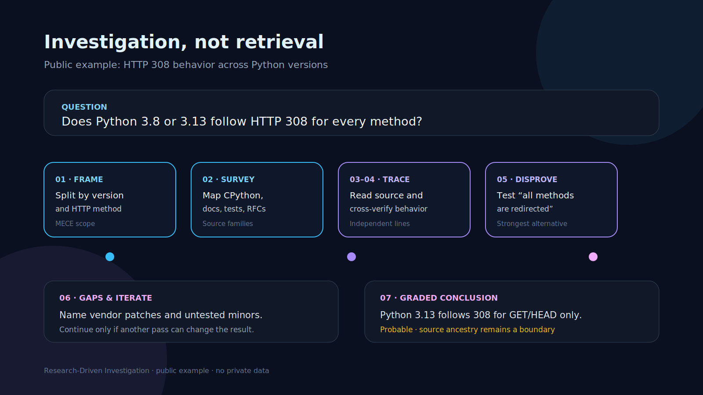
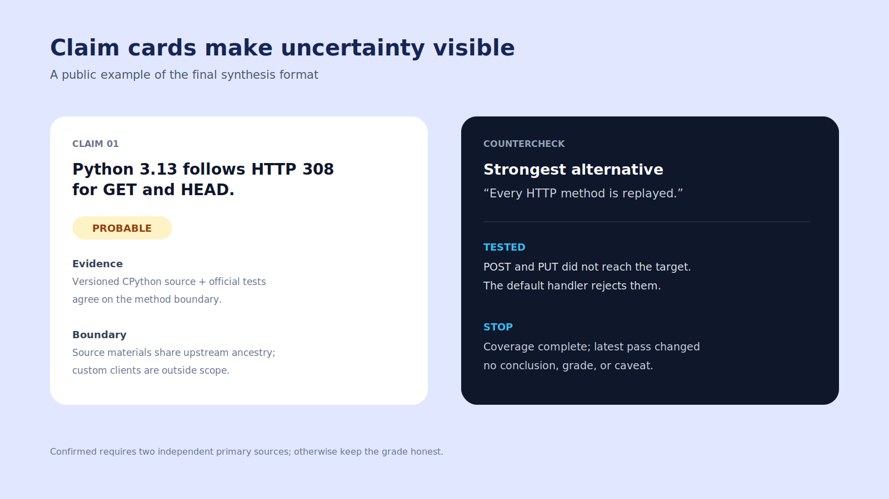

# Research-Driven Investigation

> Move an AI agent from "finding a plausible answer" to "constructing a conclusion that survives attack."

[中文 README](README.md) · Interface language: 中文 (primary) / English


[](LICENSE)

A pure-methodology Agent Skill for Claude Code, Codex, and Gemini CLI. It provides no scripts, stores no data, and hosts no secrets; it changes how an agent investigates a question.

<table>
  <tr>
    <td width="50%"></td>
    <td width="50%"></td>
  </tr>
  <tr>
    <td align="center"><strong>Seven-step investigation: from question to graded conclusion</strong></td>
    <td align="center"><strong>Claim cards: make uncertainty visible at a glance</strong></td>
  </tr>
</table>

## What it does

Research-Driven turns ordinary retrieval into investigation:

- Decompose complex questions into MECE sub-questions.
- Trace key facts to primary sources instead of stopping at snippets or summaries.
- Cross-verify every key conclusion with at least two genuinely independent sources.
- Actively seek counterexamples, boundary cases, and the strongest opposing evidence.
- Grade certainty as Confirmed, Probable, Speculative, or Unknown.
- Stop only after coverage, disconfirmation, and convergence; avoid over-researching trivial facts.

## Why it exists

Agents can produce fluent answers quickly, but they often stop at the first plausible result, mistake repeated sources for independent confirmation, collect only supporting evidence, or write inference as fact. This Skill maximizes correctness and labels remaining uncertainty honestly; it never guarantees a correct answer.

## Problems it helps solve

Use it for:

- Documentation, API, pricing, license, standards, version, and current-fact research.
- Multi-part questions, conflicting sources, low-confidence judgments, and high-impact decisions.
- Research that must be handed off or independently reviewed.
- Cross-platform research with Claude Code, Codex, or Gemini CLI.

Do not use it for trivial facts already known with high certainty, casual chat, pure formatting, mechanical edits, unauthorized private data, or login bypasses.

## Smallest useful example

1. Install this directory in your Agent Skill directory.
2. Start a new session with:

   ```text
   Use blcaptain-research-driven to investigate whether Python 3.8 and 3.13 natively follow HTTP 308.
   Give primary sources, counterevidence, boundaries, and a certainty grade for each conclusion.
   ```

3. Expect a conclusion, decisive evidence, countercheck, boundaries, open gaps, and per-claim certainty grades.

## Install

- Claude Code: copy this directory to `~/.claude/skills/blcaptain-research-driven/`.
- Codex: copy this directory to `$HOME/.agents/skills/blcaptain-research-driven/`.
- Gemini CLI: run `gemini skills link /absolute/path/to/blcaptain-research-driven`.

## Workflow

| Step | Agent behavior |
|---|---|
| 1. Frame and decompose | Define the decision, boundaries, and MECE sub-questions. |
| 2. Survey the landscape | Map source families, disputes, vocabulary, and blind spots. |
| 3. Trace to primary sources | Reach official documentation, original papers, source code, or primary records. |
| 4. Cross-verify | Check key conclusions against at least two genuinely independent sources. |
| 5. Actively disprove | Steelman the alternative and seek failure evidence. |
| 6. Identify gaps and iterate | Name unknowns and loop until STOP conditions hold. |
| 7. Synthesize with graded certainty | Lead with the conclusion, then evidence, countercheck, boundaries, and grades. |

## Structure

```text
blcaptain-research-driven/
├── SKILL.md                         # Core methodology for agents
├── README.md                        # Chinese documentation
├── README.en.md                     # English documentation
├── LICENSE                          # Apache License 2.0
├── VERSION                          # Release version
├── CHANGELOG.md                     # User-facing release notes
├── .gitignore                       # Protect credentials and local files
├── agents/
│   └── interface.yaml               # Agent display metadata
├── assets/
│   ├── research-log-template.md     # Optional research log template
│   └── screenshots/                 # Public example images
├── references/
│   ├── techniques.md                # Detailed investigation techniques
│   └── tool-mapping.md              # Cross-platform capability mapping
└── templates/
    ├── research-request.md          # Copyable beginner request
    └── research-result.example.md   # Public-fact research example
```

## Data and privacy

- This Skill does not upload, store, or host user data or secrets.
- Never commit API keys, cookies, account details, internal paths, private URLs, or unauthorized exports.
- Publish only public sources, synthetic examples, and shareable documentation.
- Keep research logs local by default and review them for personal or internal information before publishing.

## About the author

Created and maintained independently by 爆裂队长NEXT (BLCaptain).

- GitHub: [@dososo](https://github.com/dososo)
- X / Twitter: [@thinkszyg](https://x.com/thinkszyg)
- Email: blteam2026@outlook.com
- Maintainer of the Traditional Chinese Pattern Catalog project: [wenyang.net](https://wenyang.net)

If this project helps you, please star it, share it, or reach out on X.

## License

Apache License 2.0. See [LICENSE](LICENSE).
